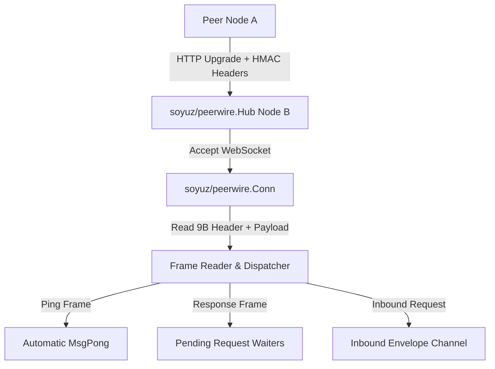

# SDD Spec 001: Peerwire Binary Framing, WebSocket Hub & HMAC Handshake Auth

## Metadata
* **Status:** `COMPLETED`
* **Author:** Antigravity (Consigliere)
* **Created:** 2026-07-23
* **Last Updated:** 2026-07-23
* **Approver:** Codefather

---

## Phase 1: Proposal (Rough Idea)

### 1.1 Problem Statement
Distributed nodes in `c6s` and `s3d` need a zero-dependency, multiplexed P2P wire transport over HTTP/HTTPS WebSockets with strict frame size bounds and HMAC authentication to prevent unauthorized node joins.

### 1.2 Proposed Solution
Implement package `soyuz/peerwire`:
- 9-byte binary header followed by variable-length payload.
- HMAC-SHA256 handshake token authentication (`X-C6S-Auth-Token`, `X-C6S-Auth-Time`, `X-C6S-Worker-ID`) with 5-second timestamp skew validation.
- Connection Hub (`peerwire.Hub`) managing inbound HTTP upgrades, outgoing peer dialing, frame multiplexing, and async requests/responses.

### 1.3 Scope & Requirements
* **In Scope:**
  * 9-byte header framing (`[MsgType(1B)][RequestID(4B)][Len(4B)][Payload]`).
  * HMAC-SHA256 pre-shared secret token authentication.
  * Inbound HTTP WebSocket handler (`HandleHTTP`) and outbound WebSocket dialer (`Dial`).
  * Asynchronous `Send` and synchronous `Request` multiplexing over pending request channels.
  * Ping/Pong liveness heartbeat loop.
* **Out of Scope:**
  * Transport TLS management (handled at infrastructure boundary).

---

## Phase 2: System Design (SDD)

### 2.1 Architecture & Components



### 2.2 Data Structures & Interfaces

```go
type MsgType byte

type Frame struct {
    Type      MsgType
    RequestID uint32
    Payload   []byte
}

type Envelope struct {
    PeerID string
    Frame  Frame
}
```

---

## Phase 3: Implementation Plan (IP)

### 3.1 Task Breakdown
- [x] **Task 1:** Build binary frame serializer (`WriteFrame`) and deserializer (`ReadFrame`).
  - **Files:** `peerwire/frame.go`
  - **Verification:** `GOWORK=off go test -v ./peerwire`
- [x] **Task 2:** Implement `Conn` multiplexing and liveness ping loop.
  - **Files:** `peerwire/conn.go`
  - **Verification:** `GOWORK=off go test -v ./peerwire`
- [x] **Task 3:** Implement `Hub` connection manager, HMAC auth verification, and HTTP handler.
  - **Files:** `peerwire/hub.go`, `peerwire/hub_test.go`
  - **Verification:** `GOWORK=off go test -v ./peerwire`

---

## Phase 4: Execution & Verification
- [x] All per-task verification steps pass.
- [x] Linter / vet clean.
- [x] Unit tests pass.

---

## Phase 5: Completed
- [x] All Phase 4 items `[x]`.
- [x] No regressions.
- [x] Spec document reflects actual implementation.
- [x] `spec/README.md` updated to `COMPLETED`.
- [x] Approved by the User.
