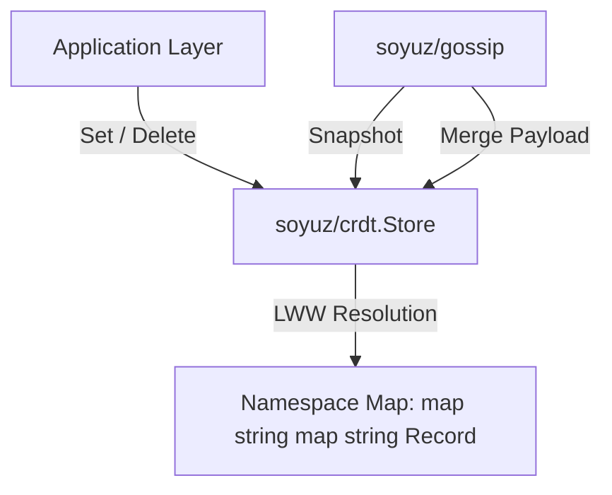

# SDD Spec 002: LWW Key-Value CRDT Engine & Namespace Partitioning

## Metadata
* **Status:** `COMPLETED`
* **Author:** Antigravity (Consigliere)
* **Created:** 2026-07-23
* **Last Updated:** 2026-07-23
* **Approver:** Codefather

---

## Phase 1: Proposal (Rough Idea)

### 1.1 Problem Statement
Both `c6s` cluster control state and `s3d` storage metadata require eventually consistent replication across distributed nodes without single points of failure.

### 1.2 Proposed Solution
Implement package `soyuz/crdt`:
- Thread-safe key/value store partitioned into logical namespaces.
- Last-Write-Wins (LWW) resolution rules evaluated on `(Epoch, Timestamp, ByteCompare)`.
- Explicit tombstone markers (`Tombstone: true`) for deletions to prevent resurrecting deleted keys across merge cycles.

### 1.3 Scope & Requirements
* **In Scope:**
  * In-memory CRDT store with concurrent read/write locks.
  * Namespace key lookup, listing, mutations (`Set`), and soft deletion (`Delete`).
  * Full snapshot generation (`Snapshot`) and snapshot merging (`Merge`).
* **Out of Scope:**
  * Direct disk persistence (handled by host application integration).

---

## Phase 2: System Design (SDD)

### 2.1 Architecture & Components



### 2.2 Data Structures & Interfaces

```go
type Record struct {
    Value     json.RawMessage `json:"value,omitempty"`
    Timestamp int64           `json:"timestamp"`
    Epoch     int64           `json:"epoch,omitempty"`
    Tombstone bool            `json:"tombstone,omitempty"`
}

type Payload struct {
    Namespaces map[string]map[string]Record `json:"namespaces"`
}
```

---

## Phase 3: Implementation Plan (IP)

### 3.1 Task Breakdown
- [x] **Task 1:** Implement `Record` struct and JSON value marshaling.
  - **Files:** `crdt/types.go`
  - **Verification:** `GOWORK=off go test -v ./crdt`
- [x] **Task 2:** Implement `Store` with LWW winning rule (`isLWWWinner`).
  - **Files:** `crdt/store.go`, `crdt/store_test.go`
  - **Verification:** `GOWORK=off go test -v ./crdt`

---

## Phase 4: Execution & Verification
- [x] All per-task verification steps pass.
- [x] Linter / vet clean.
- [x] Unit tests pass.

---

## Phase 5: Completed
- [x] All Phase 4 items `[x]`.
- [x] Spec document reflects actual implementation.
- [x] `spec/README.md` updated to `COMPLETED`.
- [x] Approved by the User.
