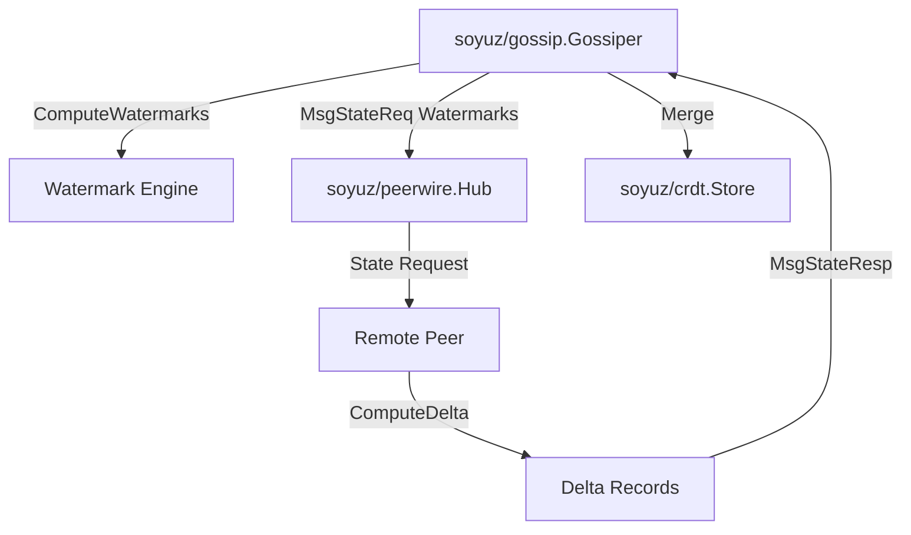

# SDD Spec 003: Epoch-Based Watermark Anti-Entropy Gossip

## Metadata
* **Status:** `COMPLETED`
* **Author:** Antigravity (Consigliere)
* **Created:** 2026-07-23
* **Last Updated:** 2026-07-23
* **Approver:** Codefather

---

## Phase 1: Proposal (Rough Idea)

### 1.1 Problem Statement
Unified P2P cluster synchronization across `c6s` and `s3d` requires an anti-entropy mechanism that avoids transmitting full state database dumps or computing heavy Merkle bucket trees over uniform SHA-256 block keys.

### 1.2 Proposed Solution
Implement package `soyuz/gossip` using **Epoch-Based High-Watermark Anti-Entropy**:
1. **Active Delta Broadcast (`PushDelta`)**: On mutation, nodes immediately broadcast an event-driven `MsgGossipPush` frame containing only the new record(s).
2. **Passive High-Watermark Sync (`Round`)**: Every `sync_interval` (5s), nodes exchange namespace high watermarks `(MaxEpoch, MaxTimestamp)`.
3. **Delta Exchange**:
   - If watermarks match $\rightarrow$ **0 bytes transferred**.
   - If watermarks differ $\rightarrow$ Peer returns `MsgStateResp` carrying only records with `(Epoch, Timestamp) > PeerWatermark`.

### 1.3 Scope & Requirements
* **In Scope:**
  * `ComputeWatermarks` and `ComputeDelta` functions.
  * Direct delta push (`PushDelta`) and state request handler (`HandleStateReq`).
  * Unified Epoch-based anti-entropy engine powering both `c6s` and `s3d`.
* **Out of Scope:**
  * Merkle bucket partitioning (removed as unnecessary overhead for uniform block hashes).

---

## Phase 2: System Design (SDD)

### 2.1 Architecture & Components



### 2.2 Data Structures & Interfaces

```go
type WatermarkEntry struct {
    Epoch     int64 `json:"epoch"`
    Timestamp int64 `json:"timestamp"`
}

type WatermarkMap map[string]WatermarkEntry

type StateReqPayload struct {
    Watermarks WatermarkMap `json:"watermarks"`
}

type StateRespPayload struct {
    Delta crdt.Payload `json:"delta"`
}
```

---

## Phase 3: Implementation Plan (IP)

### 3.1 Task Breakdown
- [x] **Task 1:** Build watermark computation (`ComputeWatermarks`) and delta selection (`ComputeDelta`).
  - **Files:** `gossip/watermark.go`
  - **Verification:** `GOWORK=off go test -v ./gossip`
- [x] **Task 2:** Build `Gossiper` runner loop, active delta push, and state response handler.
  - **Files:** `gossip/gossip.go`, `gossip/gossip_test.go`
  - **Verification:** `GOWORK=off go test -v ./gossip`

---

## Phase 4: Execution & Verification
- [x] All per-task verification steps pass.
- [x] Linter / vet clean.
- [x] Unit tests pass.

---

## Phase 5: Completed
- [x] All Phase 4 items `[x]`.
- [x] Spec document reflects actual implementation.
- [x] `spec/README.md` updated to `COMPLETED`.
- [x] Approved by the User.
