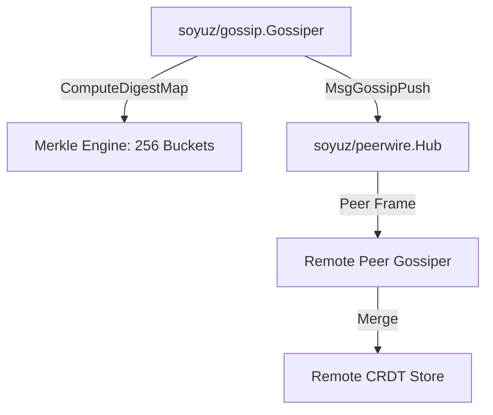

# SDD Spec 003: 256-Bucket Merkle Digest Anti-Entropy Gossip

## Metadata
* **Status:** `COMPLETED`
* **Author:** Antigravity (Consigliere)
* **Created:** 2026-07-23
* **Last Updated:** 2026-07-23
* **Approver:** Codefather

---

## Phase 1: Proposal (Rough Idea)

### 1.1 Problem Statement
Nodes must synchronize CRDT state updates periodically without transmitting full state data across the network when no changes have occurred.

### 1.2 Proposed Solution
Implement package `soyuz/gossip` with a **dual-mode anti-entropy engine**:
1. **Direct Push Sync (`PushSync`)**: Sends full state snapshot (`MsgGossipPush`). Ideal for `c6s` control-plane state (low key count, fast 1-round convergence).
2. **Merkle Range Exchange Sync (`MerkleSync`)**: 256-bucket key space partitioning (`ComputeDigestMap`, `MismatchedBuckets`, `MsgStateReq`/`MsgStateResp`). Ideal for `s3d` high-cardinality storage metadata (millions of keys, avoids transmitting unmodified state).

### 1.3 Scope & Requirements
* **In Scope:**
  * Direct snapshot push sync for control-plane workloads (`c6s`).
  * 256-bucket SHA-256 Merkle digest computation and bucket mismatch detection for high-cardinality metadata (`s3d`).
  * Frame dispatch (`MsgGossipPush`, `MsgStateReq`, `MsgStateResp`) over `peerwire.Hub`.
* **Out of Scope:**
  * Hierarchical Merkle trees (deferred to future scaling revision).

---

## Phase 2: System Design (SDD)

### 2.1 Architecture & Components



### 2.2 Data Structures & Interfaces

```go
const BucketCount = 256

type DigestMap [BucketCount][32]byte

type Gossiper struct {
    store    *crdt.Store
    hub      *peerwire.Hub
    selfID   string
    interval time.Duration
}
```

---

## Phase 3: Implementation Plan (IP)

### 3.1 Task Breakdown
- [x] **Task 1:** Build Merkle digest calculation (`ComputeDigestMap`) and bucket comparison (`MismatchedBuckets`).
  - **Files:** `gossip/merkle.go`
  - **Verification:** `GOWORK=off go test -v ./gossip`
- [x] **Task 2:** Build `Gossiper` round execution and payload handler.
  - **Files:** `gossip/gossip.go`, `gossip/gossip_test.go`
  - **Verification:** `GOWORK=off go test -v ./gossip`

---

## Phase 4: Execution & Verification
- [x] All per-task verification steps pass.
- [x] Linter / vet clean.
- [x] Unit tests pass.

---

## Phase 5: Completed
- [x] All Phase 4 items `[x]`.
- [x] Spec document reflects actual implementation.
- [x] `spec/README.md` updated to `COMPLETED`.
- [x] Approved by the User.
