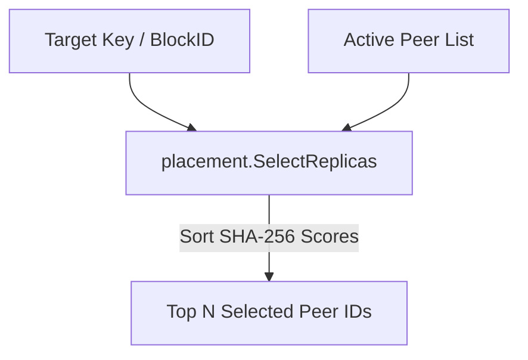

# SDD Spec 004: Rendezvous (HRW) Replica Placement Selector

## Metadata
* **Status:** `COMPLETED`
* **Author:** Antigravity (Consigliere)
* **Created:** 2026-07-23
* **Last Updated:** 2026-07-23
* **Approver:** Codefather

---

## Phase 1: Proposal (Rough Idea)

### 1.1 Problem Statement
Replication of storage blocks and distributed resource items requires selecting target nodes deterministically across peers without central coordination or global lock managers.

### 1.2 Proposed Solution
Implement package `soyuz/placement`:
- Highest Random Weight (HRW) Rendezvous Hashing algorithm.
- Deterministic scoring function: `Score(key, peerID) = BigEndianUint64(SHA256(key || peerID))`.
- Sort candidate peers by score descending, breaking ties with string peerID comparison.

### 1.3 Scope & Requirements
* **In Scope:**
  * `SelectReplicas(key, activePeers, count)` pure function.
  * Deterministic placement across all cluster nodes sharing the same active peer set.
* **Out of Scope:**
  * Dynamic node weighting (equal node weight for v1).

---

## Phase 2: System Design (SDD)

### 2.1 Architecture & Components



### 2.2 Data Structures & Interfaces

```go
func SelectReplicas(key string, activePeers []string, count int) []string
```

---

## Phase 3: Implementation Plan (IP)

### 3.1 Task Breakdown
- [x] **Task 1:** Implement HRW Rendezvous Hashing score computation and replica selector.
  - **Files:** `placement/hrw.go`, `placement/hrw_test.go`
  - **Verification:** `GOWORK=off go test -v ./placement`

---

## Phase 4: Execution & Verification
- [x] All per-task verification steps pass.
- [x] Linter / vet clean.
- [x] Unit tests pass.

---

## Phase 5: Completed
- [x] All Phase 4 items `[x]`.
- [x] Spec document reflects actual implementation.
- [x] `spec/README.md` updated to `COMPLETED`.
- [x] Approved by the User.
