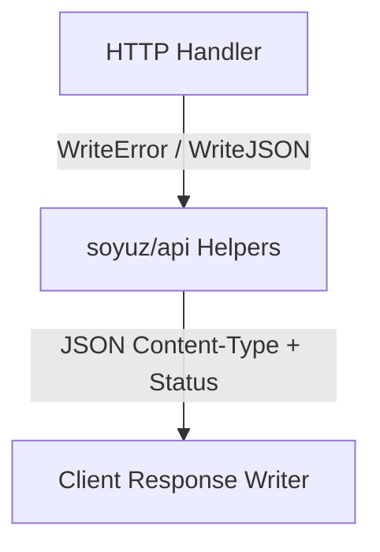

# SDD Spec 005: HTTP REST API Response Helpers & Standard Error Contracts

## Metadata
* **Status:** `COMPLETED`
* **Author:** Antigravity (Consigliere)
* **Created:** 2026-07-23
* **Last Updated:** 2026-07-23
* **Approver:** Codefather

---

## Phase 1: Proposal (Rough Idea)

### 1.1 Problem Statement
Services building on `soyuz` require unified REST API response formatting and standard JSON error payloads across HTTP control endpoints.

### 1.2 Proposed Solution
Implement package `soyuz/api`:
- `WriteJSON(w, status, data)` for JSON responses with standard content-type headers.
- `WriteError(w, status, message)` producing standardized `ErrorResponse` JSON objects.

### 1.3 Scope & Requirements
* **In Scope:**
  * `ErrorResponse` struct definition (`error`, `code`, `details`).
  * Response writing helpers (`WriteJSON`, `WriteError`).

---

## Phase 2: System Design (SDD)

### 2.1 Architecture & Components



### 2.2 Data Structures & Interfaces

```go
type ErrorResponse struct {
    Error   string `json:"error"`
    Code    int    `json:"code"`
    Details string `json:"details,omitempty"`
}

func WriteJSON(w http.ResponseWriter, status int, v any)
func WriteError(w http.ResponseWriter, status int, msg string)
```

---

## Phase 3: Implementation Plan (IP)

### 3.1 Task Breakdown
- [x] **Task 1:** Implement HTTP REST response helpers and error contract struct.
  - **Files:** `api/server.go`
  - **Verification:** `GOWORK=off go test -v ./...`

---

## Phase 4: Execution & Verification
- [x] All per-task verification steps pass.
- [x] Linter / vet clean.
- [x] Unit tests pass.

---

## Phase 5: Completed
- [x] All Phase 4 items `[x]`.
- [x] Spec document reflects actual implementation.
- [x] `spec/README.md` updated to `COMPLETED`.
- [x] Approved by the User.
