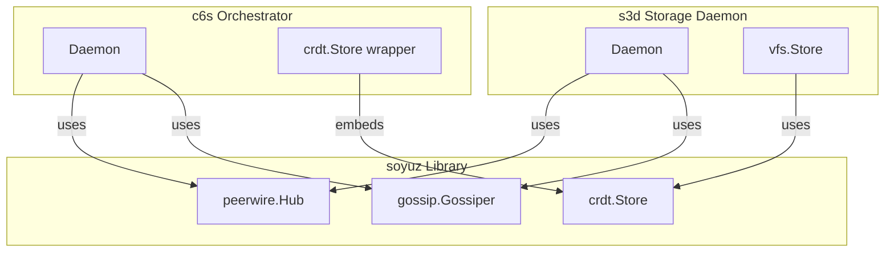

# SDD Spec: Consolidate Soyuz Library

## Metadata
* **Status:** `COMPLETED`
* **Author:** Antigravity (Consigliere)
* **Created:** 2026-08-10
* **Last Updated:** 2026-08-10
* **Approver:** Codefather

---

## Phase 1: Proposal (Rough Idea)

### 1.1 Problem Statement
The workspace has duplicate/redundant implementations of core libraries:
1. `c6s/internal/peerwire` is a 100% duplicate alias/wrapper of the `soyuz/peerwire` library.
2. `c6s/internal/gossip` is a custom gossip implementation that does not use the watermark-based push-pull gossip of `soyuz/gossip`.
3. `c6s/internal/crdt` replicates parts of `soyuz/crdt` (LWW state engine, store) but wraps it to add persistence, `/secrets` custom versioning, and epoch-based upserts.

We need to consolidate these to use the vanilla unified libraries from `soyuz` across both `c6s` and `s3d`.

### 1.2 Proposed Solution
1. **Peerwire**: Remove `c6s/internal/peerwire` entirely and use `github.com/c6s-zavod/soyuz/peerwire` directly in all `c6s` packages.
2. **Gossip**: Update `soyuz/gossip.Gossiper` to support an optional dynamic sync interval callback. Replace `c6s/internal/gossip` with `github.com/c6s-zavod/soyuz/gossip`.
3. **CRDT**: Add custom comparator support or a merge-wins policy callback to `soyuz/crdt.Store` so that `c6s`'s custom `/secrets` versioning logic can be injected. Support persistence callbacks/hooks or simplify `c6s/internal/crdt` to embed and delegate to `soyuz/crdt.Store`.

### 1.3 Scope & Requirements
* **In Scope:**
  * Delete `c6s/internal/peerwire` and update all imports in `c6s` to use `soyuz/peerwire`.
  * Delete `c6s/internal/gossip` and update `c6s` to use `soyuz/gossip` (with dynamic sync interval).
  * Refactor `c6s/internal/crdt` so it delegates map operations and LWW logic directly to `soyuz/crdt.Store`, keeping only its persistence and namespace-checking logic.
  * Verify all tests build and pass in `c6s`, `s3d`, and `soyuz`.
* **Out of Scope:**
  * Changes to the REST APIs or external configuration file schemas.
  * Changes to P2P wire format/frames.

---

## Phase 2: System Design (SDD)

### 2.1 Architecture & Components

We consolidate the duplicated libraries by exposing extensibility hooks in `soyuz/crdt` and `soyuz/gossip` so that `c6s` and `s3d` can customize behavior without maintaining fork/duplicate packages.



### 2.2 Data Structures & Interfaces

#### 2.2.1 `soyuz/crdt` Additions

1. Support explicit record retrieval and insertion so wrappers can manage custom fields (like epochs and tombstones) while delegating state mapping to the core engine:
   ```go
   // GetRecord retrieves a record from the given namespace, including tombstones.
   func (s *Store) GetRecord(namespace, key string) (Record, bool)

   // SetRecord inserts or updates a key using LWW rules with a pre-constructed Record.
   func (s *Store) SetRecord(namespace, key string, rec Record) (bool, error)
   ```

2. Add configurable comparison callback hook to override standard LWW wins rules (crucial for `c6s` custom `/secrets` version-based tie-breakers):
   ```go
   // SetCompareHook sets a custom comparison function to override the default LWW wins rule.
   func (s *Store) SetCompareHook(fn func(namespace, key string, incoming, existing Record) bool)
   ```

3. Update default `isLWWWinner` tie-breaker to check `Tombstone` state so that deletions consistently win on identical epoch/timestamps:
   ```go
   if incoming.Tombstone != existing.Tombstone {
       return incoming.Tombstone
   }
   ```

#### 2.2.2 `soyuz/gossip` Additions

1. Add dynamic interval callback so applications can adapt sync rates based on live CRDT config changes (e.g. `/config` namespace updates):
   ```go
   type Gossiper struct {
       ...
       IntervalFn func() time.Duration
   }
   ```

2. Inside `Gossiper.Run(ctx)`, reset or query `IntervalFn` if present on each iteration.

---

## Phase 3: Implementation Plan (IP)

### 3.1 Task Breakdown

- [x] **Task 1: Add `GetRecord`, `SetRecord`, `SetCompareHook`, and tombstone tie-break to `soyuz/crdt`**
  - **Files:** `soyuz/crdt/store.go`
  - **Verification:** `cd soyuz && make test`

- [x] **Task 2: Add dynamic interval callback support to `soyuz/gossip`**
  - **Files:** `soyuz/gossip/gossip.go`
  - **Verification:** `cd soyuz && make test`

- [x] **Task 3: Refactor `c6s/internal/crdt` to wrap and delegate to `soyuz/crdt`**
  - **Files:** `c6s/internal/crdt/store.go`
  - **Verification:** `cd c6s && go test ./internal/crdt/...`

- [x] **Task 4: Delete duplicate `c6s/internal/peerwire` and use `soyuz/peerwire` directly**
  - **Files:** delete folder `c6s/internal/peerwire`, modify all imports in `c6s` referencing it
  - **Verification:** `cd c6s && go test ./...`

- [x] **Task 5: Delete duplicate `c6s/internal/gossip` and use `soyuz/gossip` directly**
  - **Files:** delete folder `c6s/internal/gossip`, modify `c6s/internal/daemon/daemon.go` and others referencing it
  - **Verification:** `cd c6s && go test ./...`

- [x] **Task 6: Final check in both modules**
  - **Verification:** `cd c6s && make all` and `cd s3d && make all` and `cd soyuz && make all`

### 3.2 Risks & Mitigation
- **Race conditions/deadlocks during `SetChangeHook` persistence**: Persistence writes are triggered outside the store locks inside the hook. We must ensure BoltDB is thread-safe (which it natively is under single-write transactions) and that we do not recursively call store operations within the hook.
- **WebSocket handshakes route conflict**: Check that the websocket dial path remains identical (`/v1/ws/peer`).

---

## Phase 4: Execution & Verification

- [x] All per-task verification steps pass.
- [x] Linter / vet clean across `soyuz`, `c6s`, and `s3d`.
- [x] Unit tests pass across all packages in `soyuz`, `c6s`, and `s3d`.

---

## Phase 5: Completed

- [x] All Phase 4 items `[x]`.
- [x] No regressions.
- [x] Spec document reflects actual implementation.
- [x] `spec/README.md` updated to `COMPLETED`.
- [x] Approved by the Codefather.
